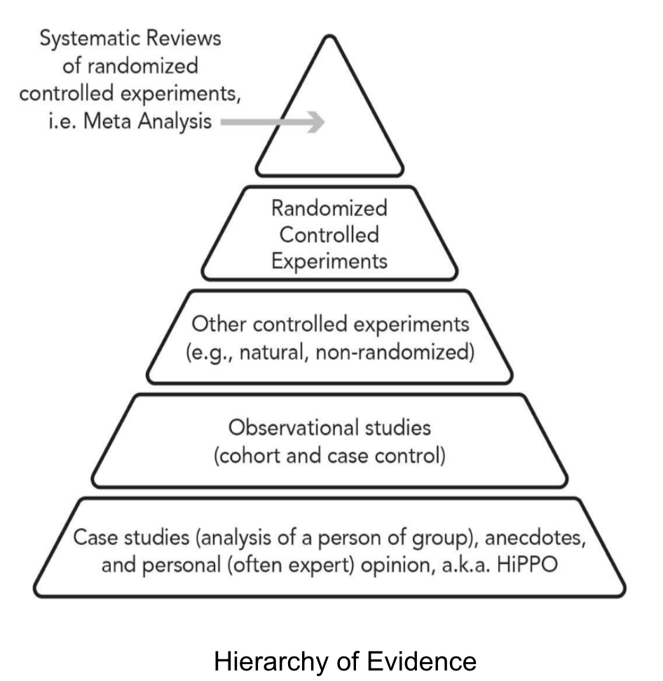
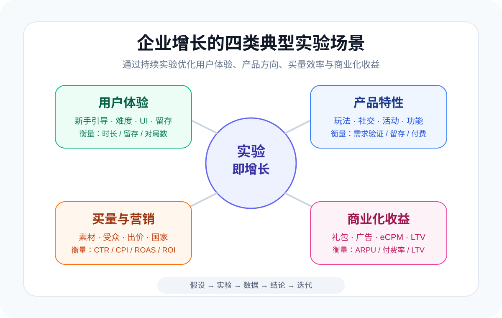

增长不是一次灵感，也不是某个爆款素材、某个新渠道、某个产品改版带来的偶然结果。

真正可持续的增长，来自一套能够不断提出假设、验证假设、沉淀结论、再继续迭代的实验体系（贝叶斯方法）。

我想用一句话概括这个观点：**实验即增长。** 这也是**展博增长实验室推出的产品（实验&增长咨询服务，面向内容、电商、应用等非游戏行业提供实验&增长的诊断、咨询、平台建设、业务陪跑等服务）**。

尤其在面向全球市场的数字业务里，这句话更接近现实。因为数字业务面对的是高度不确定的市场：不同国家、不同文化、不同平台、不同获客环境、不同用户付费习惯，都可能让同一个产品表现出完全不同的增长曲线。

在这种环境下，企业不能只依赖经验判断，而要依赖实验。

---

## 一、为什么说“实验”是增长的基础？

科学的基础不是“我觉得”，而是“可论证”。

从证据可信度来看，我们可以看到一个从低到高的金字塔：案例研究、观察研究、类实验、随机控制实验，以及更高层级的统合分析。

这些方法形式不同，但本质上都在回答同一个问题：

**某个变化，是否真的带来了结果？**

在商业增长里，这个问题尤其关键。

比如：

- 留存提升，是因为新手引导改得更好，还是因为这批用户质量本来更高？
- ROI 提升，是因为素材策略有效，还是因为渠道算法短期波动？
- 付费率提升，是因为礼包设计更合理，还是因为活动期间用户天然更愿意付费？

如果没有实验体系，团队很容易把相关性误判为因果关系，把短期波动误判为方法论，把偶然成功误判为可复制能力。

所以，增长团队真正需要的不是更多“拍脑袋的优化建议”，而是一套持续验证因果关系的机制。

---

## 二、为什么增长离不开实验？

增长是所有商业组织前进的动力。

但增长本身不是一个单点问题，而是一组连续问题：

- 如何让更多用户看到产品？
- 如何让用户愿意下载或进入游戏？
- 如何让用户留下来？
- 如何让用户持续活跃？
- 如何让用户付费？
- 如何让 LTV 高于获客成本？

这些问题之间相互关联，任何一个环节的改动，都可能影响整体增长效率。

在数字业务里，增长链路尤其长：从素材、广告、商店页、下载、首日体验、新手引导、核心循环、活动运营、付费设计，到广告变现和再营销，每一步都有优化空间。

这也是为什么我认为：

**增长不是找到一个答案，而是建立一套不断找到答案的系统。**

这个系统的核心，就是实验。

---

## 三、数字业务公司的四类典型实验场景

如果把数字业务公司的增长拆开看，实验至少会发生在四个关键场景里：用户体验、产品特性、买量与营销效率、商业化收益。

### 1. 用户体验实验：优化用户进入产品后的第一感受

用户体验实验关注的是：用户是否愿意继续玩下去。

常见实验包括：

- 新手引导流程调整
- 首局难度设计
- UI 布局优化
- 任务系统节奏
- 奖励反馈强度
- 核心玩法教学方式

衡量指标通常包括：

- 使用时长
- 次日留存、七日留存
- 对局数
- 关卡完成率
- GMV 或早期付费转化
- 用户流失节点

例如，一个产品可能会测试两种新手引导：一种是强引导，明确告诉用户每一步怎么操作；另一种是弱引导，让用户更快进入核心玩法。

表面上看，强引导更“清楚”；但实验结果可能显示，弱引导让用户更快获得乐趣，反而提升了留存。

这就是实验的价值：它能帮助团队摆脱主观偏好，回到用户真实行为。

### 2. 产品特性实验：探索产品该往哪里发展

产品特性实验关注的是：产品是否真正解决了用户需求。

常见实验包括：

- 新玩法模块
- 社交系统
- 排行榜
- 活动机制
- 关卡类型
- 道具系统
- 个性化内容推荐

这类实验不只是验证“功能有没有用”，更重要的是帮助团队判断产品方向。

比如一个产品团队想增加社交功能，可能会先做一个轻量版本：好友邀请、排行榜或组队奖励。实验的目标不是一开始就把社交系统做完整，而是验证：用户是否真的有社交动机，社交是否能带来留存或付费提升。

产品实验的关键，不是“做更多功能”，而是用最小成本验证产品假设。

### 3. 买量和营销效率实验：提升 ROI 的外延增长能力

买量实验关注的是：如何更高效地获得用户。

在数字业务里，这类实验通常发生在两个层面：

- **产品内实验**：商店页、素材落地页、首日体验、付费点设计
- **媒体侧实验**：广告素材、受众包、出价策略、投放国家、Campaign 结构

常见实验包括：

- 不同素材方向测试
- 不同广告文案测试
- 不同国家和地区投放测试
- 不同受众包测试
- 不同优化目标测试
- 不同 Campaign 结构测试

衡量指标通常包括：

- CTR
- CVR
- CPI
- IPM
- ROAS
- ROI
- Payback 周期

买量团队最容易陷入的误区，是只看单个素材或单个 Campaign 的短期表现。

但真正成熟的增长团队，会把买量实验沉淀为一套可复用的知识资产：什么题材适合哪个市场，什么卖点适合什么人群，什么素材结构更容易触发点击，什么付费模型更适合扩大预算。

这类沉淀，最终会变成公司的增长资产。

### 4. 商业化实验：提升 LTV，为增长提供弹药

商业化实验关注的是：每个用户能贡献多少长期价值。

对于数字业务来说，商业化通常分为两类：

- IAP：内购收入
- IAA：广告变现收入

常见实验包括：

- 礼包定价
- 首充设计
- 订阅机制
- 激励视频广告位置
- 插屏广告频次
- 广告瀑布流策略
- eCPM 优化
- 付费用户分层运营

衡量指标包括：

- ARPU
- ARPPU
- 付费率
- LTV
- eCPM
- 广告展示次数
- 广告填充率
- 用户留存变化

商业化实验的难点在于，它不能只看短期收入。

比如提高广告频次，短期可能提升广告收入，但也可能伤害留存，降低长期 LTV。提高礼包价格，短期可能提升 ARPPU，但也可能降低付费率。

所以商业化实验必须同时看收入指标和用户体验指标，避免为了短期收益透支长期增长。

---

## 四、实验体系的价值：从“经验增长”走向“系统增长”

很多团队早期增长依赖经验：谁投放经验丰富，谁对产品感觉好，谁对素材敏感，谁就能带来结果。

但经验有两个问题：

第一，经验很难复制。

第二，经验很容易过期。

平台算法会变，用户偏好会变，素材疲劳会出现，竞争环境会变化。过去有效的方法，不代表现在依然有效。

实验体系的价值，是把增长从个人经验转化为组织能力。

它至少带来四个结果：

1. **降低决策风险**：重大改动先小流量验证，避免全量上线造成损失。
2. **提升学习速度**：每次实验都沉淀结论，团队持续积累对用户和市场的理解。
3. **提高资源效率**：把研发、买量、运营资源投入到被验证过的方向上。
4. **形成增长复利**：实验结论不断累积，最终形成别人难以复制的增长知识库。

这也是“实验即增长”的真正含义：实验不是增长团队的辅助工具，而是增长系统本身。

---

## 五、给小团队的建议：不要一开始追求复杂平台，先建立实验习惯

很多小 studio 听到 AB 测试、实验平台、数据体系，会本能觉得这是一件很重的事情。

但实验不一定从复杂系统开始。

小团队更应该先建立三个习惯：

### 1. 每次优化前，先写清楚假设

不要只写“优化新手引导”，而要写：

> 我们认为当前新手引导过长，导致用户在第一局前流失。如果缩短引导步骤，用户更快进入核心玩法，次日留存会提升。

假设越清楚，实验越容易判断成败。

### 2. 每次实验只验证一个主要问题

不要一次改太多东西。

如果同时改 UI、奖励、难度和文案，即使指标变化了，也很难判断到底是哪一个因素起作用。

小团队更需要控制变量，因为资源有限，经不起无效学习。

### 3. 每次实验后，沉淀可复用结论

实验结束不是看一眼数据就结束，而要回答三个问题：

- 这次实验验证了什么？
- 对后续产品、买量或商业化有什么启发？
- 这个结论能否迁移到其他国家、渠道或产品？

当团队持续这样做，实验就会从一次次零散测试，变成增长知识库。

---

## 六、如果你想更系统地学习和应用实验，可以看看 abtest.chat

如果你正在搭建实验体系，或者想系统理解 AB 测试、因果推断、实验设计和增长分析，我推荐关注一个工具：

**abtest.chat**：https://abtest.chat/

它适合几类人：

- 想把 AB 测试从“看数据”提升到“理解因果”的增长负责人
- 需要设计产品实验、商业化实验、买量实验的数据产品经理
- 希望建立实验文化，但还缺少方法论框架的小团队
- 正在做工具产品、电商或内容产品增长的人

对我来说，abtest.chat 的价值不只是提供 AB 测试知识，而是帮助团队建立一种更重要的思维方式：

**先提出假设，再设计实验，再用数据验证，而不是先做决策，再用数据解释。**

这正是增长团队最需要的基本功。

---

## 结语：增长的本质，是持续学习

数字行业变化很快。

平台算法会变，素材风格会变，用户偏好会变，买量成本会变，商业化环境也会变。

在这样的环境里，真正可靠的不是某个固定答案，而是持续找到答案的能力。

实验就是这种能力的核心机制。

所以，如果用一句话总结：

**增长不是靠猜对一次，而是靠持续验证；不是靠单点爆发，而是靠实验复利。**

这就是我说的：实验即增长。

---

## 延伸阅读

- [竞对靠实验跑出了增长，为什么我们不行？]()——已经在做实验但结果不可信、推全反转，先做个诊断。
