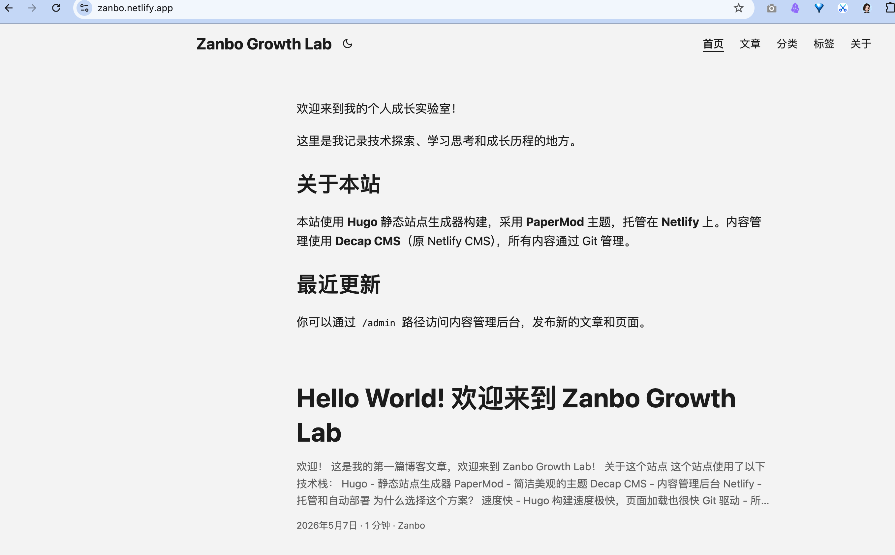

## 欢迎！

这是我的第一篇博客文章，欢迎来到 **Zanbo Growth Lab**！

<<<<<<< HEAD

=======
 
>>>>>>> 6757040 (test)

## 关于这个站点

这个站点使用了以下技术栈：

- **Hugo** - 静态站点生成器
- **PaperMod** - 简洁美观的主题
- **Decap CMS** - 内容管理后台
- **Netlify** - 托管和自动部署

## 为什么选择这个方案？

1. **速度快** - Hugo 构建速度极快，页面加载也很快
2. **Git 驱动** - 所有内容都在 Git 中管理，版本控制方便
3. **免费托管** - Netlify 提供免费的托管和 CDN
4. **可视化编辑** - 通过 `/admin` 可以可视化编辑内容

## 接下来的计划

- [ ] 配置 Giscus 评论系统
- [ ] 发布更多技术文章
- [ ] 完善站点的分类和标签
- [ ] 添加更多个性化配置

---

感谢你的访问！欢迎常来看看 😄
